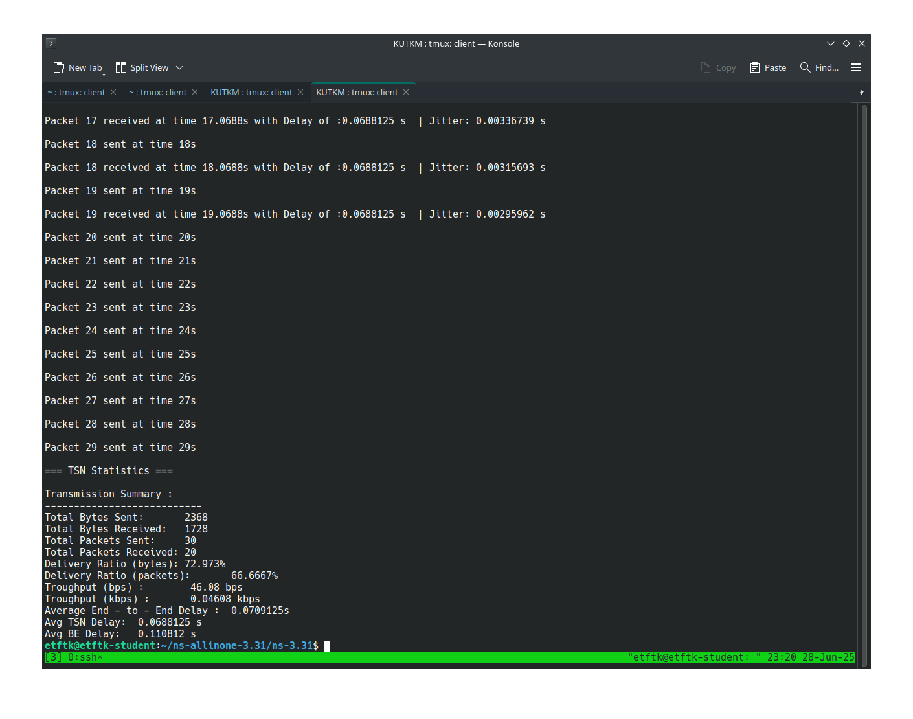
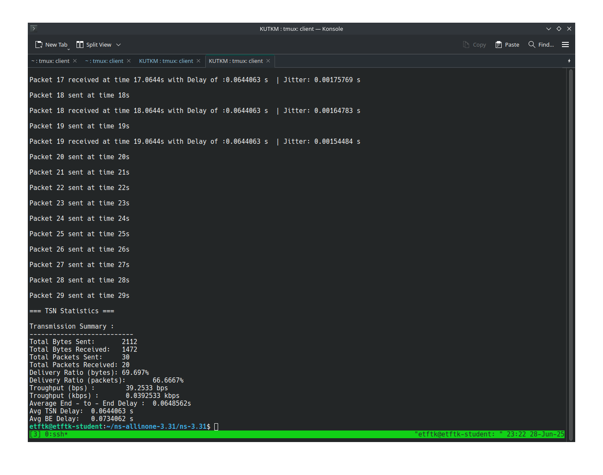

# Time-Sensitive-Networking

## Preduslovi za simulaciju

*Potrebno je poduzeti sljedeće korake kako bi se instalirala potrebna verzija ns-3 simulatora, kao i tsn dodaci:*

- *Preuzmite ns-3 simulator i instalirajte ga:*

```bash
cd ~;
curl -LO https://www.nsnam.org/releases/ns-allinone-3.31.tar.bz2;
tar -xvf ns-allinone-3.31.tar.bz2;
rm ns-allinone-3.31.tar.bz2;
git clone https://github.com/DenKrysos/Time-Aware-Shaper-TAS-in-ns-3.git;
rm ns-allinone-3.31/ns-3.31/contrib/ -rf && cp Time-Aware-Shaper-TAS-in-ns-3/ns-3_Implementation/contrib/ ns-allinone-3.31/ns-3.31/contrib/ -r;
cd ns-allinone-3.31/ns-3.31/;
sudo apt install python2 -y;
sed -i 's/python3/python2/g' waf;
./waf configure --enable-tests --enable-examples --disable-python && ./waf build;
```

*U suštini, značenje prethodno navedenih komandi je sljedeće:*

- Mijenja se aktivni direktorij; 
- Preuzima se 3.31 verzija ns3 simulatora; 
- Izvlače se podaci iz tar arhive; 
- Preuzima se git repozitorij sa TSN dodacima;
- Briše se contrib folder iz foldera ns3 simulatora i briše se prethodno preuzeti git repozitorij;
- Prelazi se u glavni folder ns3 simulatora;
- Instalira se python verzija 2;
- Mijenja se python verzija is `waf` datoteke iz treće u drugu zbog kompatibilnosti;
- Konfiguriše se ns3 simulator s omogućenim primjerima;
- Testovima i onemogućenim python dodacima;
- Kompajlira se ns3 simulator.

## Pokretanje koda

Datoteke koje se nalaze u: `kodovi/scratch` folderu se trebaju premjestiti u scratch folder prethodno instaliranog ns3 simulatora folderu se trebaju premjestiti u scratch folder prethodno instaliranog ns3 simulatora..

*Kod se može pokrenuti na sljedeći način:*

```bash
./waf --run=TSN2
```

Pored `TSN2` koda, mogu se pokrenuti i `TSN3` i `TSN4` kodovi. Pokretanje svakog od ovih kodova će prikazati različite rezultate simulacije.

`gnuplot.sh` jer skripta koja se nalazi u: `kodovi` folderu. Može se preuzeti i sačuvati na bilo kojoj lokaciji, a pokreće se na sljedeći način (nakon što se promijeni aktivni direktorij u direktorij gdje se ova skripta nalazi):

```bash
. gnuplot.sh
```

Ova skripta omogućava brojne funkcionalnosti, poput promjene aktivnog direktorija, generisanje gnuplot datoteka, filtriranje ispisa simulacije, a glavna svrha joj je kreiranje gnuplot dijagrama. Ovo na kraju kreira folder: "Time-Sensitive-Networking", u kojem se nalaze folderi za xml datoteke, gnuplot dijagrame, pcap datoteke i log datoteke. Potrebno je koristiti tačku prilikom poziva ove skripte zbog funkcija poput `cd` koje se koriste u istoj skripti.

Ispis nakon pokretanja date skripte nakon završetka iste prikazuje gdje se nalazi kreirani folder.

## Rezultati

### Ispis iz terminala 


*Rezultati nakon pokretanja `TSN2` skripte*


*Rezultati nakon pokretanja `TSN3` skripte*


*Rezultati nakon pokretanja `TSN4` skripte*

### GnuPlot dijagrami


*GnuPlot rezultati TSN2 skripte*


*GnuPlot rezultati TSN3 skripte*


*GnuPlot rezultati TSN4 skripte*


