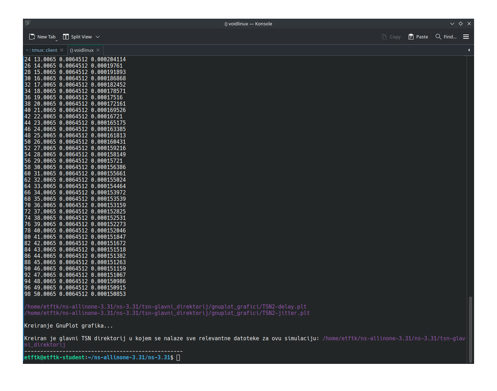
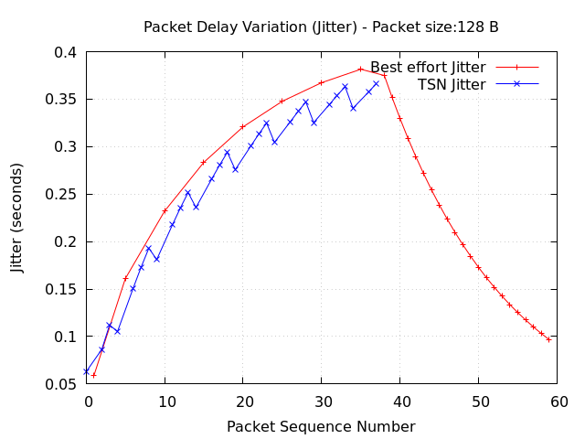

# Time-Sensitive-Networking

## Preduslovi za simulaciju

Kako bi se omogućila implementacija TSN-a u ns-3 simulatoru, koristile su se pomoćni kodovi sa sljedećeg GitHub linka: [](https://github.com/DenKrysos/Time-Aware-Shaper-TAS-in-ns-3). Verzija ns-3 simulatora koja je korištena za implementaciju pomoćnih skripti je `3.31`, te se stoga prepručuju ispod navedeni koraci kako bi se ista verzija ns-3 simulatora instalirala.

*Potrebno je poduzeti sljedeće korake kako bi se instalirala potrebna verzija ns-3 simulatora, kao i tsn dodaci:*

- *Preuzmite ns-3 simulator i instalirajte ga:*

```bash
cd ~;
curl -LO https://www.nsnam.org/releases/ns-allinone-3.31.tar.bz2;
tar -xvf ns-allinone-3.31.tar.bz2;
rm ns-allinone-3.31.tar.bz2;
git clone https://github.com/DenKrysos/Time-Aware-Shaper-TAS-in-ns-3.git;
rm ns-allinone-3.31/ns-3.31/contrib/ -rf && cp Time-Aware-Shaper-TAS-in-ns-3/ns-3_Implementation/contrib/ ns-allinone-3.31/ns-3.31/contrib/ -r;
cd ns-allinone-3.31/ns-3.31/;
sudo apt install python2 -y;
sed -i 's/python3/python2/g' waf;
./waf configure --enable-tests --enable-examples --disable-python && ./waf build;
```

*U suštini, značenje prethodno navedenih komandi je sljedeće:*

- Mijenja se aktivni direktorij; 
- Preuzima se 3.31 verzija ns-3 simulatora; 
- Izvlače se podaci iz tar arhive; 
- Preuzima se git repozitorij sa TSN dodacima;
- Briše se contrib folder iz foldera ns-3 simulatora i briše se prethodno preuzeti git repozitorij;
- Prelazi se u glavni folder ns-3 simulatora;
- Instalira se python verzija 2;
- Mijenja se python verzija is `waf` datoteke iz treće u drugu zbog kompatibilnosti;
- Konfiguriše se ns-3 simulator s omogućenim primjerima;
- Testovima i onemogućenim python dodacima;
- Kompajlira se ns-3 simulator.

## Pokretanje koda

Datoteke koje se nalaze u: `kodovi/scratch` folderu se trebaju premjestiti u scratch folder prethodno instaliranog ns-3 simulatora folderu se trebaju premjestiti u scratch folder prethodno instaliranog ns-3 simulatora..

*Kod se može pokrenuti na sljedeći način:*

```bash
./waf --run=TSN1
```

ovime se pokreće prvi od dva slučaja TSN-a.

Pored `TSN1` koda, mogu se pokrenuti i `TSN2` i `TSN-P2P` kodovi. Pokretanje svakog od ovih kodova će prikazati različite rezultate simulacije.

`tsn-gnuplot.sh` je bash skripta koja se nalazi u: `kodovi` folderu i pokreće `TSN1.cc` i `TSN2.cc` TSN simulacije. Može se preuzeti i sačuvati na bilo kojoj lokaciji, a pokreće se na sljedeći način (nakon što se promijeni aktivni direktorij u direktorij gdje se ova skripta nalazi):

```bash
. tsn-gnuplot.sh
```

Ova skripta omogućava brojne funkcionalnosti, poput promjene aktivnog direktorija, generisanje gnuplot datoteka, filtriranje ispisa simulacije, a glavna svrha joj je kreiranje gnuplot dijagrama. Korisniku je također omogućen unos parametara veličine i broja paketa. Ovo na kraju kreira folder: "tsn-glavni\_direktorij", u kojem se nalaze folderi za xml datoteke, gnuplot dijagrame, pcap datoteke i log datoteke. Potrebno je koristiti tačku prilikom poziva ove skripte zbog funkcija poput `cd` koje se koriste u istoj skripti.

Ispis nakon pokretanja date skripte, i nakon njenog završetka, prikazuje gdje se nalazi kreirani folder.

## Rezultati

### Ispis iz terminala 

Preporučuje se pokretanje `tsn-gnuplot.sh` skripte koja automatski kreira sve neophodne datoteke i gnuplot grafike, te sve to smješta u glavni direktorij `tsn-glavni_direktorij`. Odabran je prvi slučaj sa 60 paketa veličine 128 bajta, te drugi slučaj sa 100 paketa i 64 bajta. Može se primijetiti da se u skripti piše pola od željene vrijednosti maksimalnog broja paketa jer so ovo u simulaciji odnosi na maksimalan broj paketa po klasifikaciji paketa: BE - (eng: Best Effort) ili TSN - (eng: Time-Sensitive Networking).


*Pokretanje `tsn-gnuplot.sh` bash skripte i određivanje parametara prvog slučaja*


*Pokretanje `tsn-gnuplot.sh` bash skripte i određivanje parametara drugog slučaja*


*Konačan ispis`tsn-gnuplot.sh` bash skripte*

### GnuPlot dijagrami


*GnuPlot grafički prikaz kašnjenja prvog slučaja simulacije*



*GnuPlot grafički prikaz jitter-a prvog slučaja simulacije*


*GnuPlot grafički prikaz kašnjenja drugog slučaja simulacije*


*GnuPlot grafički prikaz jitter-a drugog slučaja simulacije*


*GnuPlot grafički prikaz komparacije propusnosti prvog i drugog slučaja simulacija*

### Video snimci

*Video snimke je najbolje pokrenuti pomoću VLC-a*

*Sljedeća tri video snimka prikazuju filtriranje mrežnog saobraćaja koji je zapisan i sačuvan u .pcap datoteke nakon pokretanja simulacije:*


*Filtriranje .pcap datoteke prvog slučaja (TSN1.cc)*


*Filtriranje .pcap datoteke prvog slučaja (TSN2.cc)*


*Filtriranje .pcap datoteke prvog slučaja (TSN4.cc)*

*Sljedeća tri video snimka prikazuju vizuelizaciju mrežne topologije u NetAnim-u:*


*Filtriranje .pcap datoteke prvog slučaja (TSN1.cc)*


*Filtriranje .pcap datoteke prvog slučaja (TSN2.cc)*


*Filtriranje .pcap datoteke prvog slučaja (TSN4.cc)*
